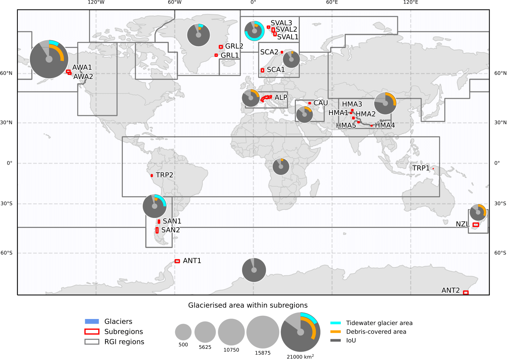
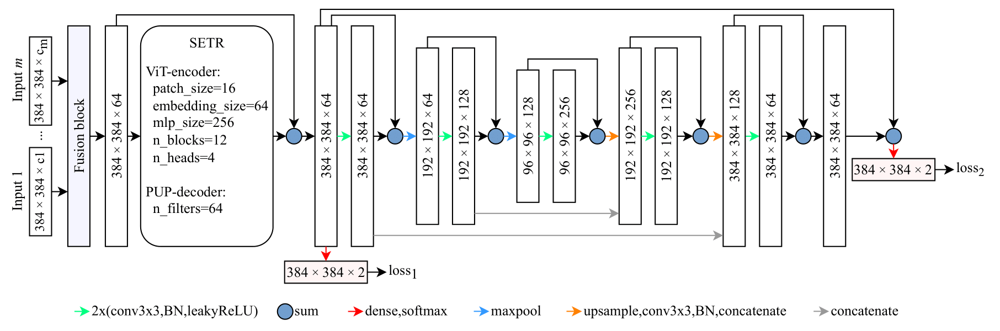

# Scalable Glacier Mapping using Deep Learning and Open Earth Observation Data Matches the Accuracy of Manual Delineation

[Konstantin A. Maslov](https://people.utwente.nl/k.a.maslov), [Claudio Persello](https://people.utwente.nl/c.persello), [Thomas Schellenberger](https://www.mn.uio.no/geo/english/people/aca/geohyd/thosche/), [Alfred Stein](https://people.utwente.nl/a.stein)

[[`Paper`](https://arxiv.org/abs/2401.15113)] [[`Datasets`](#datasets)] [[`BibTeX`](#citing)] 

<br/>



<!--  -->

This GitHub repository is dedicated to the suite of tools and techniques developed in our study "Scalable Glacier Mapping using Deep Learning and Open Earth Observation Data Matches the Accuracy of Manual Delineation." 
Accurate global glacier mapping is critical for understanding climate change impacts. 
Despite its importance, automated glacier mapping at a global scale remains largely unexplored. 
Here we address this gap and propose Glacier-VisionTransformer-U-Net (GlaViTU), a convolutional-transformer deep learning model, and five strategies for multitemporal global-scale glacier mapping using open satellite imagery. 
Assessing the spatial, temporal and cross-sensor generalisation shows that our best strategy achieves intersection over union >0.85 on previously unobserved images in most cases, which drops to >0.75 for debris-rich areas such as High-Mountain Asia and increases to >0.90 for regions dominated by clean ice. 
A comparative validation against human expert uncertainties in terms of area and distance deviations underscores GlaViTU performance, approaching or matching expert-level delineation. 
Adding synthetic aperture radar data, namely, backscatter and interferometric coherence, increases the accuracy in all regions where available. 
The calibrated confidence for glacier extents is reported making the predictions more reliable and interpretable. 
We also release a benchmark dataset that covers 9% of glaciers worldwide. 
Our results support efforts towards automated multitemporal and global glacier mapping. 


## Datasets

You can access the tile-based dataset that can be used to train a model and to assess its performance on it [here](https://bit.ly/3UgEDgA). 
If you wish to try the code only, you may want to use a [demo dataset](https://bit.ly/49aVPIJ), which is just a 10% subsample of the main one. 
For more challenging spatial and temporal generalisation tests, there is a [independent acquisition test dataset](https://bit.ly/48WUGoA) that contains completely different in space and time acquisitions from those in the tile-based dataset. 
The datasets will be also possible to access in [DANS](https://dans.knaw.nl/en/), where they will be uploaded shortly. 


## Installation 

### Required hardware

We recommend using a machine with at least 24 GB GPU RAM and 64 RAM. 
Technically, any modern computer is suitable to run the provided code. 
However, no GPU or not enough RAM can make the computational time unreasonably long (up to months and even years). 
In case if your RAM is not enough to perform inference on your own data with our pretrained models, consider splitting it into smaller subareas. 
If your machine lacks GPU RAM, you may consider reducing the batch size by modifying `batch_size = ...` in `configs/data.py` accordingly. 
Please note that altering the batch size can potentially change the expected performance of the models if you train them from scratch.


### Instructions

We recommend using the [Anaconda](https://www.anaconda.com/download) or [Miniconda](https://docs.conda.io/projects/miniconda/en/latest/) Python distributions. 
After installing one of them, one can use the `conda` package manager to install the required libraries in a new environment called `massive-tf` and activate it by running

```
conda create -n massive-tf "tensorflow==2.11" h5py scikit-learn rioxarray geopandas jupyterlab tqdm -c conda-forge
conda activate massive-tf
```

We tested this configuration on Ubuntu 20.04 and Ubuntu 22.04 (see `envs/env_ub2004.yml` and `envs/env_ub2204.yml` for tested dependencies). 
We also expect it to work on any modern Linux distribution or Windows, given properly configured NVIDIA GPU drivers.


## Getting started

We deliver our codebase as a set of python scripts and a couple of Jupyter notebooks. 
For every `.py` file, there is a manual page available by running it with the `-h` (or `--help`) flag. 
In case of confusion, you might like to see these manual pages. 

### Adjusting configs

First, adjust the data config file. 
Find the following lines in `configs/data.py`

```
train_dataset_path = ...
val_dataset_path = ...
test_dataset_path = ...

predictions_dir = ...
```

And replace the paths to the downloaded subsets of the tile-based dataset depending on where you store them. 
The `predictions_dir` variable should contain a path to the folder where you would like to store the prediction results. 

### Training/finetuning a model

Once Python is successfully installed and configs are adjusted properly, one can start training glacier mapping models. 
For example, to train a global GlaViTU model as in the paper, run

```
(massive-tf) python train.py -n glavitu_global -f optical dem --contrast --occlusion --noise --label_smoothing 0.1
```

To use location encoding, you might want to provide either the `--region_encoding` flag or the `--coordinate_encoding` flag. 
To train a model for one region or a cluster of regions, list them after the `-r` flag (e.g., `-r AWA ALP LL`). 
Note that the regions are named differently here as compared to the paper&mdash;`ALP` (the European Alps), `AN` (Antarctica), `AWA` (Alaska and Western America), `CA` (Caucasus), `GR` (Greenland), `HMA` (High-Mountain Asia), `LL` (low latitudes), `NZ` (New Zealand), `SA` (the Southern Andes), `SC` (Scandinavia) and `SVAL` (Svalbard). 
Also, to change the feature set used, adjust the list after the `-f` flag. 
Available features are `optical`, `dem`, `co_pol_sar`, `cross_pol_sar`, `in_sar` and `thermal`.
Please, run `python train.py -h` to see all available options.

Similarly, a model can be finetuned further (e.g., for the European Alps)

```
(massive-tf) python finetune.py -n glavitu_finetuning_ALP -r ALP -f optical dem -w weights/glavitu_global_weights.h5 --contrast --occlusion --noise --label_smoothing 0.1
```

### Predicting on the test subset

To predict on the testing set, call the `predict.py` script copying all model-related parameters. 
For example, if the model was trained as shown above, it will be 

```
(massive-tf) python predict.py -n glavitu_global -f optical dem
```

You might want to run the script with the `--val` flag to predict on the validation set, which is needed for predictive confidence calibration. 

### Evaluating on the test subset

To get the estimation of a model performance on the testing set, run

```
(massive-tf) python evaluate.py -n glavitu_global
```

It will output the averaged performance of the model as well as IoU scores for every region and subregion in the dataset. 
If a model was trained as shown above, you will see the numbers close to those reported in the paper as derived with GlaViTU and the global strategy. 

### Running on custom/standalone data

The workflow below is also summarised in a Jupyter Notebook that you can find [`here`](demo.ipynb).

To run models on a custom data, e.g., your own region of interest, you first have to compile the features into one `.pickle` file. 
The minimal set of features that must be provided include optical (6 TOA bands&mdash;blue, green, red, near infrared, shortwave infrared 1 and shortwave infrared 2), elevation (in m) and slope (in deg) data. 
You might want to provide additional SAR backscatter (sigma0 values in linear scale for both orbital directions stacked as separate bands), InSAR interferometric coherence and thermal (in K) features. 
The features are provided as `.tif` georeferenced rasters. 
Make sure that the rasters are defined on the same grid before proceeding. 
To create a `.pickle` file with the features, run

```
(massive-tf) python compile_features.py --optical <PATH/TO/OPTICAL.tif> --elevation <PATH/TO/ELEVATION.tif> --slope <PATH/TO/SLOPE.tif> --output <PATH/TO/OUTPUT.pickle> 
```

Additional features can be provided with optional flags&mdash;`--co_pol_sar`, `--cross_pol_sar`, `--in_sar` and `--thermal`.

Once the features are compiled, run

```
(massive-tf) python deploy.py <PATH/TO/FEATURES.pickle> -o <OUTPUT/FOLDER> -n glavitu_global -f optical dem --smoothing 3
```

It will create two raster files as outputs&mdash;`outlines.tif` and `confidence.tif` that can be analysed further in a GIS. 
Check `python utils/geo/polygonise.py -h` for converting `outlines.tif` into a vector shapefile. 
You might also want to check the `--tta` flag of `deploy.py` that enables test-time augmentation.
While not reported in the paper, we found that test-time augmentation provides a more robust behaviour of the model yet often leads to a decrease in accuracy (in our experiments). 
Note, however, that `--tta` will increase the inference time by approx. eight times.


### Confidence calibration

To calibrate the predictive confidence, you will need to prepare a pretrained model and run it on the validation set. 
To do so, simply run `predict.py` as shown above with the `--val` flag. 
Then follow the [`confidence_calibration.ipynb`](confidence_calibration.ipynb) notebook, where you will need to adjust the paths and get a `.pickle` instance of the confidence calibration model.  

After you have saved a confidence calibration model, you can use it for inference as follows

```
(massive-tf) python deploy.py ... -cm <CALIBRATION MODEL.pickle> ... 
```


### Bias optimisation

To obtain an optimised bias/region vector for your area of interest, go through the [`bias_optimisation.ipynb`](bias_optimisation.ipynb) notebook. 
You will have to prepare a pretrained model and a feature `.pickle` file (see above) beforehand. 
Follow the instruction in the notebok, which mainly are to adjust the paths to your files. 

After that, simply run

```
(massive-tf) python deploy.py ... -rv <REGION VECTOR.pickle> ... 
```


## Pretrained models

The pretrained models that were used to derive the results in the paper can be accessed [here](https://bit.ly/3HC4TdQ). 
The file names follow the template `<MODEL NAME>_<STRATEGY>[_<REGIONS,>][_<DATA TRACK>]_weights.h5`. 
We encourage you to try different options in your area of interest and share your results. 


## Ice divides

We moved the algorithms for ice divides reconstruction to [a different repository](https://github.com/konstantin-a-maslov/massive_ice_divides).


## License

This software is licensed under the [GNU General Public License v2](LICENSE).


## Citing

To cite the paper/repository, please use the following bib entry. 

<!-- TODO: Update BibTeX once published ```
@article{towardsglobalglaciermapping2024,
    title={Towards Global Glacier Mapping with Deep Learning and Open Earth Observation Data},
    author={Maslov, Konstantin A. and Persello, Claudio and Schellenberger, Thomas and Stein, Alfred},
    journal={},
    year={2024},
    volume={},
    number={},
    pages={},
    doi={}
}
``` -->
```
@article{scalableglaciermapping2024,
    title = {Scalable Glacier Mapping using Deep Learning and Open Earth Observation Data Matches the Accuracy of Manual Delineation},
    author = {Maslov, Konstantin A. and Persello, Claudio and Schellenberger, Thomas and Stein, Alfred},
    doi = {10.48550/arXiv.2401.15113},    
    url = {https://arxiv.org/abs/2401.15113},
    year = {2024},
    month = {1},
}
```


<br/>

> If you notice any inaccuracies, mistakes or errors, feel free to submit a pull request or kindly email the authors.
