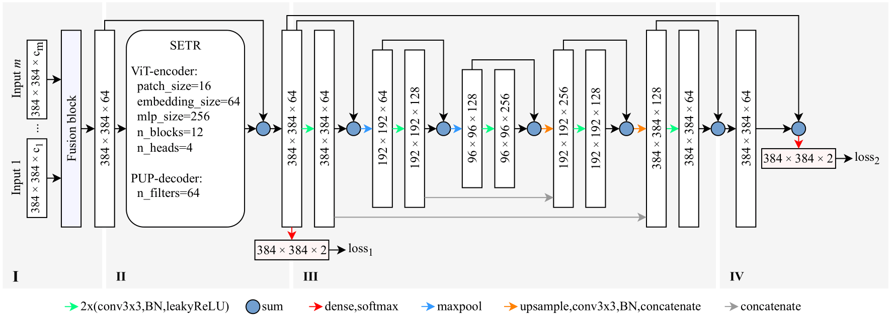

# Towards Global Glacier Mapping with Deep Learning and Open Earth Observation Data

[Konstantin A. Maslov](https://people.utwente.nl/k.a.maslov), [Claudio Persello](https://people.utwente.nl/c.persello), [Thomas Schellenberger](https://www.mn.uio.no/geo/english/people/aca/geohyd/thosche/), [Alfred Stein](https://people.utwente.nl/a.stein)

[[`Paper`](https://arxiv.org/abs/2401.15113)] [[`Datasets`](#datasets)] [[`BibTeX`](#citing)] 

<br/>


**The repository is in progress**.



This GitHub repository is dedicated to the suite of tools and techniques developed in our study "Towards Global Glacier Mapping with Deep Learning and Open Earth Observation Data." 
Accurate global glacier mapping is critical for understanding climate change impacts. 
It is challenged by glacier diversity, difficult-to-classify debris and big data processing. 
Here we propose Glacier-VisionTransformer-U-Net (GlaViTU), a convolutional-transformer deep learning model, and five strategies for multitemporal global-scale glacier mapping using open satellite imagery. 
Assessing the spatial, temporal and cross-sensor generalisation shows that our best strategy achieves intersection over union >0.85 on previously unobserved images in most cases, which drops to >0.75 for debris-rich areas such as High-Mountain Asia and increases to >0.90 for regions dominated by clean ice. 
Additionally, adding synthetic aperture radar data, namely, backscatter and interferometric coherence, increases the accuracy in all regions where available. 
The calibrated confidence for glacier extents is reported making the predictions more reliable and interpretable. 
We also release a benchmark dataset that covers 9% of glaciers worldwide. 
Our results support efforts towards automated multitemporal and global glacier mapping. 


## Datasets

You can access the main dataset than can be used to train a model and to assess preliminary its performance [here](https://bit.ly/3UgEDgA). 
If you wish to try the code only, you may want to use a [demo dataset](https://bit.ly/49aVPIJ), which is just a 10% subsample of the main one. 
For more challenging spatial and temporal generalisation tests, there is a [standalone dataset](https://bit.ly/48WUGoA) that contains acquisitions completely different from those in the main dataset. 
The datasets will be also possible to access in [DANS](https://dans.knaw.nl/en/), where they will be uploaded shortly. 


## Installation 

### Required hardware

We recommend using a machine with at least 24 GB GPU RAM and 64 RAM. 
Technically, any modern computer is suitable to run the provided code. 
However, no GPU or not enough RAM can make the computational time unreasonably long (up to months and even years). 
In case if your RAM is not enough to perform inference on your own data with our pretrained models, consider splitting it into smaller subareas. 
If your machine lacks GPU RAM, you may consider reducing the batch size by modifying `batch_size = ...` in `configs/data.py` accordingly. 
Please note that altering the batch size can potentially change the expected performance of the models if you train them from scratch.


### Instructions

We recommend using the [Anaconda](https://www.anaconda.com/download) or [Miniconda](https://docs.conda.io/projects/miniconda/en/latest/) Python distributions. 
After installing one of them, one can use the `conda` package manager to install the required libraries in a new environment called `massive-tf` and activate it by running

```
conda create -n massive-tf "tensorflow>=2.7" h5py scikit-learn rioxarray geopandas jupyterlab tqdm -c conda-forge
conda activate massive-tf
```

We tested this configuration on Ubuntu 20.04 and Ubuntu 22.04 (see `env_ub2004.yml` and `env_ub2204.yml` for tested dependencies). 
We also expect it to work on any modern Linux distribution or Windows, given properly configured NVIDIA GPU drivers.


## Getting started

TODO: Add instructions to the subsections.

### Adjusting configs

### Training/finetuning a model

```
(massive-tf) python train.py ...
```

### Predicting on the test subset

```
(massive-tf) python predict.py ...
```

### Evaluating on the test subset

```
(massive-tf) python evaluate.py ...
```

### Running on custom/standalone data

```
(massive-tf) python compile_features.py ...
(massive-tf) python deploy.py ...
```

### Confidence calibration

TODO: Do via a jupyter notebook (refactor and upload).

### Bias optimisation

TODO: Do via a jupyter notebook (refactor and upload).

After that, simply run

```
(massive-tf) python deploy.py ... -bias <BIAS VECTOR> ... 
```


## Pretrained models

The pretrained models that were used to derive the results in the paper can be accessed [here](https://bit.ly/3HC4TdQ). 
The file names follow the template `<MODEL NAME>_<STRATEGY>[_<REGIONS,>][_<DATA TRACK>]_weights.h5`. 
We encourage you to try different options in your area of interest and share your results. 


## Ice divides

We moved the algorithms for ice divides reconstruction to [a different repository]().


## License

This software is licensed under the [GNU General Public License v2](LICENSE).


## Citing

To cite the paper/repository, please use the following bib entry. 

<!-- TODO: Update BibTeX once published ```
@article{towardsglobalglaciermapping2024,
    title={Towards Global Glacier Mapping with Deep Learning and Open Earth Observation Data},
    author={Maslov, Konstantin A. and Persello, Claudio and Schellenberger, Thomas and Stein, Alfred},
    journal={},
    year={2024},
    volume={},
    number={},
    pages={},
    doi={}
}
``` -->
```
@article{towardsglobalglaciermapping2024,
    title = {Towards Global Glacier Mapping with Deep Learning and Open Earth Observation Data.},
    author = {Maslov, Konstantin A. and Persello, Claudio and Schellenberger, Thomas and Stein, Alfred},
    doi = {10.48550/arXiv.2401.15113},    
    url = {https://arxiv.org/abs/2401.15113},
    year = {2024},
    month = {1},
}
```


<br/>

> If you notice any inaccuracies, mistakes or errors, feel free to submit a pull request or kindly email the authors.
